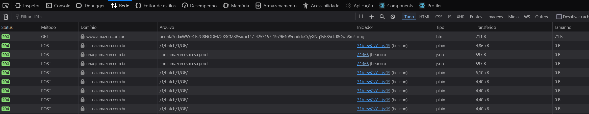
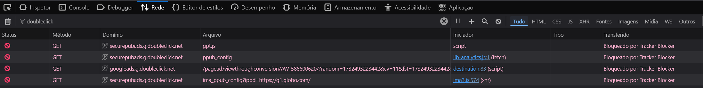
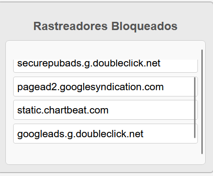
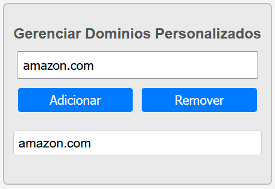
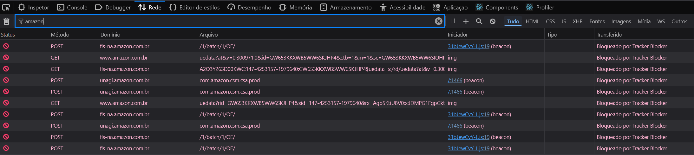

# Tracker Blocker - Firefox Plugin

## Colaboradores
- [Gustavo Oliveira](https://github.com/gustavoeso)
- [Luca Mizrahi](https://github.com/LucaMizrahi)
- [Pedro Paulo Camargo](https://github.com/PedroPauloMorenoCamargo)

## Sobre o Projeto
O **Tracker Blocker** é uma extensão para o navegador Firefox desenvolvida para bloquear rastreadores em sites. O plugin utiliza listas personalizadas e listas padrão para identificar e bloquear rastreadores durante a navegação.

## Funcionalidades
- **Bloqueio de Rastreadores**:
  - Utiliza uma lista padrão de rastreadores conhecidos.
  - Suporta uma lista personalizada criada pelo usuário.

- **Gerenciamento de Domínios**:
  - Adicionar e remover domínios na lista personalizada.

- **Interface Simples e Intuitiva**:
  - Visualize e gerencie os rastreadores diretamente na extensão.

## Funcionamento:

A extensão salva os rastreadores bloqueados de acordo com a aba atual. Ou seja, para cada aba, a extensão mantém uma lista de rastreadores que foram bloqueados naquela aba. 

**Observações Importantes**:

- Quando a extensão é removida, a lista de rastreadores bloqueados é apagada. 

- Mesmo que o bloqueio dos rastreadores seja desativado, a lista de rastreadores bloqueados é mantida com todos os rastreadores que foram bloqueados até o momento.

- O bloqueio de rastreadores é feito verificando se o domínio que deve ser bloqueado aparece na URL da requisição.

## Base de Rastreadores Utilizada

A base de rastreadores utilizada no projeto foi derivada da **[WhoTracksMe](https://www.ghostery.com/whotracksme/trackers)**, uma ferramenta da **Ghostery** para identificar rastreadores amplamente utilizados.  

A lista inicial de rastreadores incluía domínios amplamente conhecidos, como:
- **doubleclick.net**
- **googlesyndication.com**
- **ads.pubmatic.com**
- **optimizely.com**
- **chartbeat.com**

Essa lista foi expandida e adaptada ao longo do desenvolvimento para incluir rastreadores adicionais e permitir a personalização pelos usuários.

O projeto também possui um outro arquivo json com uma lista mais completa de rastreadores, que pode ser utilizada para substituir a lista padrão (`lista_personalizada.json`). 

O grupo optou por manter uma lista mais limitado(`trackerList.json`) para facilitar a visualização e a compreensão do funcionamento da extensão. Além disso, facilitar também a adição de novos domínios na lista personalizada, que ainda não estejam na lista padrão de bloqueio do plugin.

## Como Instalar
1. Faça o download dos arquivos do repositório.
2. No Firefox, vá até `about:debugging`.
3. Clique em **This Firefox** e selecione **Load Temporary Add-on**.
4. Escolha o arquivo `manifest.json` do projeto.

## Estrutura do Projeto
```plaintext
├── background.js     # Script principal para interceptar e bloquear requisições.
├── popup.html        # Interface da extensão.
├── popup.css         # Estilo da interface.
├── popup.js          # Lógica de interação do usuário.
├── trackerList.json  # Lista padrão de rastreadores.
```

## **Como Usar**

1. **Ativar/Desativar Bloqueio**  
   - Use o botão de alternância no popup para ativar ou desativar o bloqueio global de rastreadores.  

2. **Gerenciar Domínios Personalizados**  
   - Adicione ou remova domínios na lista personalizada:
     - Digite o domínio no campo de entrada.
     - Clique em "Adicionar" para incluir o domínio na lista.
     - Clique em "Remover" para excluí-lo da lista *(Para remover, o domínio deve estar na lista e escrito no campo de entrada)*.

3. **Visualizar Rastreadores Bloqueados**  
   - Acesse a seção **Rastreadores Bloqueados** no popup para visualizar os rastreadores detectados e bloqueados para o site atual.  

## Como Verificar o Funcionamento

Para garantir que a extensão está funcionando corretamente, siga este passo a passo:

1. **Abra as Ferramentas do Desenvolvedor (F12):**  
   - No Firefox, pressione `F12` ou clique no menu **Hambúrguer** (três linhas no canto superior direito), vá até **Mais Ferramentas** e selecione **Ferramentas do Desenvolvedor**.

2. **Acesse a Aba de Rede:**  
   - No painel de ferramentas, clique na aba **Rede** (Network). Isso permite monitorar todas as requisições feitas pelo site atual.

   

3. **Recarregue a Página:**  
   - Com a aba de rede aberta, recarregue o site pressionando `F5`. Agora você verá uma lista de requisições feitas pelo site.

4. **Verifique os Rastreamentos Bloqueados:**  
   - Use o campo de filtro na parte superior da aba de rede para procurar por domínios conhecidos de rastreadores, como `doubleclick.net` ou `googlesyndication.com`. 

   

   **Obs**: Observe que a coluna `Transferido` mostra que a requisição foi bloqueada pelo plugin.

5. **Confirme o Bloqueio:**  
   - Quando um rastreador for identificado e bloqueado pela extensão, você verá um status **cancelado** ou a requisição não será carregada corretamente.

6. **Veja os Rastreamentos no Popup da Extensão:**  
   - Abra o popup da extensão e confira a seção de **Rastreadores Bloqueados**. Os rastreadores bloqueados na aba atual devem aparecer listados.

   


## Observações:
- **Como Adicionar Rastreadores para Teste:**  
  - Insira um domínio comum como `amazon.com` na lista de rastreadores personalizados e teste se ele aparece no log da aba de rede.

  

- **Recarregue a Extensão Sempre que Atualizar a Lista:**  
  - Após adicionar novos rastreadores no arquivo `trackerList.json`, recarregue a extensão para que as alterações sejam aplicadas. Observe que agora as requisições que possuirem "amazon.com" serão bloqueadas.

  

## **Tecnologias Utilizadas**

- **HTML, CSS e JavaScript**  
  - Para criar a interface e lógica do plugin.  

- **API de Extensão do Firefox**  
  - Para interceptar requisições e gerenciar o bloqueio de rastreadores.  

## **Licença**

Este projeto está licenciado sob a **[MIT License](./LICENSE)**.  